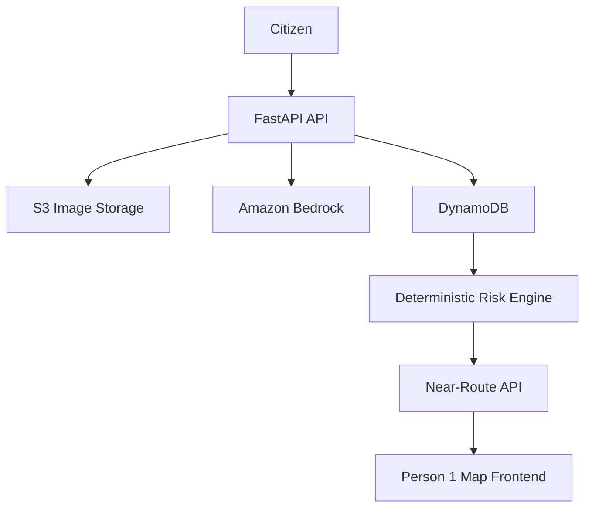

# FloodRoute Backend — Person 2

AWS-powered citizen flood-report processing and deterministic route-risk evidence API.

## Architecture



Bedrock turns unstructured citizen text/images into structured evidence. S3 stores submitted images. DynamoDB stores geotagged, time-stamped reports. The risk engine uses deterministic severity, freshness, and geographic proximity rules.

## Local setup

Python 3.x is required.

```bash
cd backend
python -m venv .venv
# Windows PowerShell: .venv\\Scripts\\Activate.ps1
# macOS/Linux: source .venv/bin/activate
pip install -r requirements.txt
copy .env.example .env   # Windows
# cp .env.example .env   # macOS/Linux
```

For a no-AWS development smoke test, set `DEMO_MODE=true`. This uses in-memory reports and a deterministic mock AI. It is for local development/tests only and does **not** represent production Bedrock behavior.

Run:

```bash
uvicorn app.main:app --reload --port 8000
```

Open `/docs` in the browser.

## Production configuration

Set `AWS_REGION`, `S3_BUCKET_NAME`, `DYNAMODB_TABLE_NAME`, `BEDROCK_MODEL_ID`, and `CORS_ORIGINS`. Credentials should come from the normal AWS SDK credential chain (AWS CLI profile, IAM role, environment, etc.). Never paste secrets into source code.

### Bedrock

The implementation uses the current Bedrock Runtime `Converse` API. The configured model ID must be available and permitted in the selected region, and image analysis requires a model with the required multimodal capability. The code intentionally does not hardcode a model ID.

### S3

Use a private bucket. Uploaded keys follow `reports/{report_id}/{uuid}.{extension}`. The service validates MIME type, extension, size, and basic file signatures. Presigned GET URLs are available through the S3 service for future image-display integration.

### DynamoDB

Create a table named `FloodReports` (or set `DYNAMODB_TABLE_NAME`) with partition key:

- `report_id` — String

The MVP uses a scan of active reports followed by application-side Haversine filtering. This is acceptable at hackathon scale but is not a high-volume geospatial indexing strategy.

### IAM minimum concepts

S3: `PutObject`, `GetObject` as needed for private image access.

DynamoDB: `PutItem`, `GetItem`, `Scan` (or a future query strategy).

Bedrock: permission to invoke the selected model using the configured runtime operation.

Avoid `AdministratorAccess` for the final setup.

## Risk heuristic

Severity weights:

- HIGH = 3
- MEDIUM = 2
- LOW = 1
- UNKNOWN = 0

Freshness multipliers:

- 0–30 minutes: 1.0
- 30–120 minutes: 0.7
- 2–6 hours: 0.4
- 6+ hours: 0.1

`score = sum(severity_weight * freshness_multiplier)` for active reports within the route radius.

Prototype route categories are `LOW`, `MEDIUM`, `HIGH`; no nearby reports returns `LOW` **reported risk**, not a safety guarantee. The heuristic is not scientifically validated.

## Demo data

After configuring AWS/DynamoDB:

```bash
python scripts/seed_demo_reports.py
```

It creates 3 HIGH, 2 MEDIUM, and 1 LOW clearly labeled `DEMO` reports with current-relative timestamps. These are fabricated test data and must not be presented as real citizen reports.

## Tests

```bash
python -m pytest -q
```

Tests use in-memory repositories and mock AI; real AWS credentials are not required.

## Example report

The endpoint is multipart because an optional image may be included:

```bash
curl -X POST http://localhost:8000/reports \
  -F "latitude=15.8281" \
  -F "longitude=78.0373" \
  -F "condition=FLOODED" \
  -F "description=Water is covering the road and motorcycles cannot pass."
```

With an image:

```bash
curl -X POST http://localhost:8000/reports \
  -F "latitude=15.8281" \
  -F "longitude=78.0373" \
  -F "condition=FLOODED" \
  -F "description=Water is covering the road and motorcycles cannot pass." \
  -F "image=@road.jpg;type=image/jpeg"
```

Route-risk request:

```bash
curl -X POST http://localhost:8000/reports/near-route \
  -H "Content-Type: application/json" \
  -d '{"route":[{"latitude":15.8281,"longitude":78.0373},{"latitude":15.8285,"longitude":78.0381}],"radius_meters":100}'
```

## Safety and limitations

Citizen reports are not authoritative. Conditions can change rapidly. AI confidence describes classification confidence, not road-danger probability. The system does not predict floods, guarantee road safety, replace official emergency alerts, or provide hydrological forecasting.

Do not intentionally upload unnecessary personal information. Images are intended for road/flood evidence; avoid unnecessary identifiable people or sensitive material.

## Deployment

First validate local FastAPI + real AWS services. Lambda/API Gateway can be added later if it does not threaten the working demo. The application is intentionally kept free of authentication, Redis, Kafka, microservices, ORM, emergency dispatch, satellite ML, and IoT.
